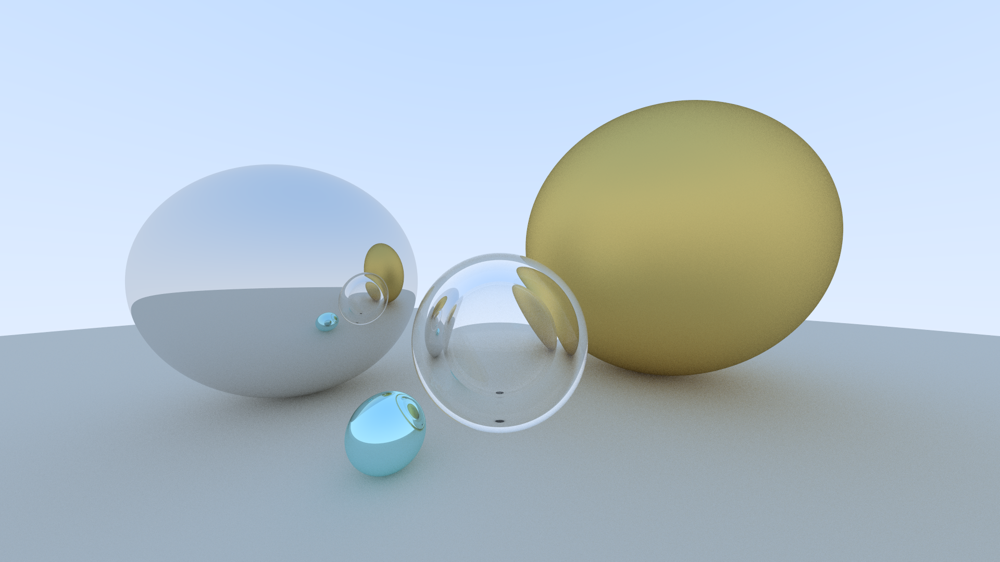

# Ray-Tracer
#### Project Remark
This is a personal project meant to build upon the ray tracer implementation from https://github.com/RayTracing/raytracing.github.io
#### Project Goals (Todo)
 - Render Triangle-Mesh based 3D objects
 - Optimize through multithreading, Octree, Hierarchical bounding volumes
#### Example Render

